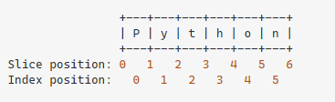
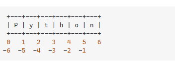
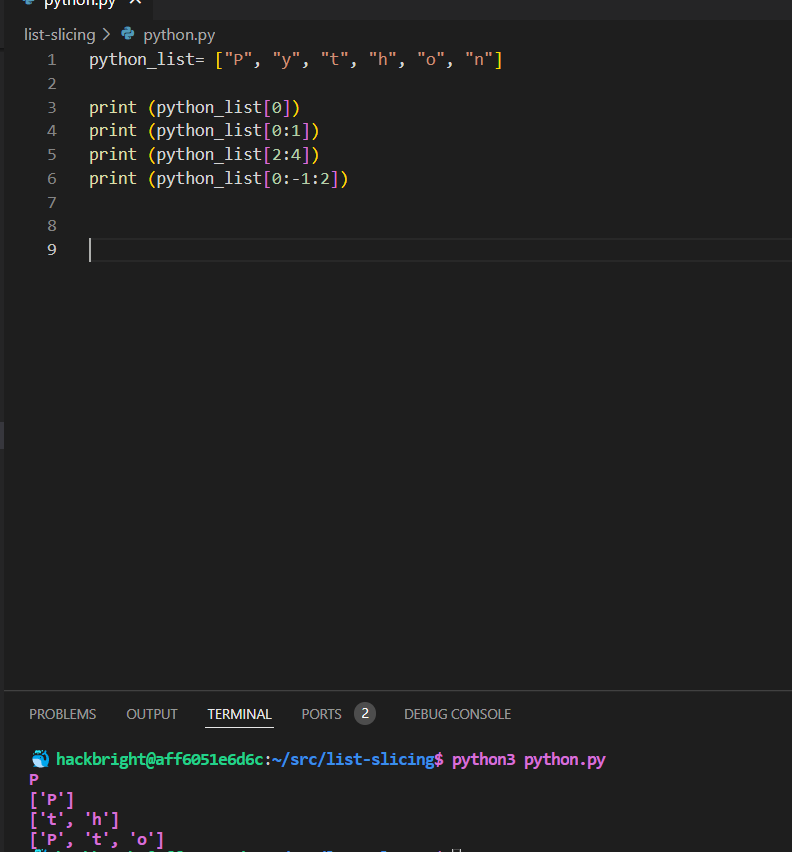

Speaking of all of these food puns, I must say, after taking a break from coding and coming back these concepts are so much easier to digest.

So let’s talk about list slicing. List slicing is the ability to access items individually inside of a list (we can also use it to change items in a list since lists are what? Mutable, that’s right!).

The syntax for this is:   list[start:stop:step] 

You can then use the index number of the value you want to access in the above syntax to perform a slice.
This concept has always been understandable for me, but I could never remember if the numbers were inclusive or not UNTIL I saw the images below:

Note the negative numbers, or negative steps. The last character of a list is -1, -2 is second to last and so on. This is REALLY helpful for lists that you don’t know how many items are in it, or if the number of items changes (which happens often with lists because they’re what? Mutable) and you need to access all the way to the end of the list. 

Some examples of how list slicing works with this example list can be seen below:

Slicing is something that I recommend practicing doing over and over. Play with the steps, try to get every other item in a list, every 3rd item, a range of items in the middle, the last 3 items. As many ways as you can think of pulling information from a list you can for practice. I personally spent 40 minutes today alone practicing list slicing! 

If you have any questions or just want to connect, feel free to reach out on LinkedIn or Github! 
