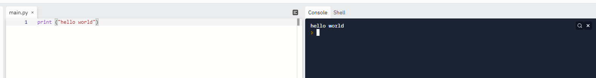
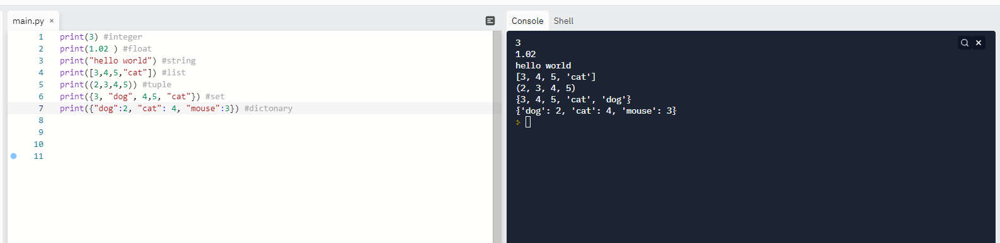

I have been thinking about what I wanted to talk about today and the main thing on my mind is getting a job. Right now, my resume is being reviewed, so I am putting a hold on applications. I did hear back from a part time teaching position for a tech pipeline, but I think it will be too far of a commute, but I am going to talk with them regardless because you never know what opportunities can come from a conversation. I also am speaking with the CEO of an API start-up soon to see if there are opportunities there. Since my application is on hold and I just gave a brief rundown, let’s talk about something else.

Python. 
I really do have a passion for education- I love teaching other people things and I love providing people with resources (thanks social work!) so I think I will take the opportunity to do so on my blog occasionally, because, remember, I was speaking. 

Let’s start from scratch- what is python? Python is a high level (what?), object-oriented (who??) and general-purpose programming language. High level language means that it enables developments in a user-friendly way and focuses more on logic than the underlying parts (memory, utilization, etc). Basically, it’s user more friendly at the potential cost of efficiency. Object oriented means that the language uses concepts of classes and objects to structure the program. This doesn’t need to make sense right now, but essentially a class is a blue print that has attributes (characteristics) and objects are individual instances of the class. (Example: A car has a color, brand, model, year etc. but that Red, Ford Mustang 2009 is an object within that class as objects can have unique values for each property in the class). Classes also contain functions called methods that can only be used on objects in that class, but I digress. 

So, generally speaking, that is what python is and more generally it’s a beginner friendly back-end programming language. 
Before we go any further, I highly recommend you check out https://replit.com/  (choose Python for your language).This site is an online compiler (place to build and run code) and is where I started coding before I set up VS Code. I will get to VS set up at some point very soon, but for now try replit.com.

Hello World is typically the first code that people write and who am I to take that away from you. If you open your compiler and type:
print (“hello world”) 

then press the run button at the top and you should see hello world displayed in what is known as the terminal. 
Of course, there is a lot more to know and a lot more to learn, but I remember when I did this activity not too long ago and here I am now. 

Let’s breakdown what we typed. First, we typed “print”, print is a function in python. Let’s briefly talk about what it means to be a function. A function is a block of code that completes a task, that’s as brief as we will make it today and we will cover functions later, for now just remember that a function tells the computer to do things. The print() function tells the computer to display whatever information is input between the parathesis or objects that are passed through the function is another way to say it. Depending on what type of information that is being passed through the function will determine if the information needs paratheses or not. In python, it is standard to use double quotes “” when they are needed but if you use single quotes ‘’ the program will still run. It is also important to note that since print is a function, you will need to include the parathesis in order for it to work. 
So, there are 3 parts: print -the actual function, () -needed to make the function work and the information that goes inside of the parathesis. 

I mentioned the word “type” and said that depending on what type of information is being passes to the python function, would depend if it needs parathesis or not. It seems unfair to go over data types and then that will be more than enough information for one day. 

Python data types: 
Numbers (Broken down to Integer and Float)
Integer- Whole numbers to be exact ex: 1, 33, 1234421, 4523, -123, 0
Float- numbers with trailing decimals (not whole values) ex: 8.5, 1.23, 2342342354398.0001
String- ordered sequence of characters ex: “hello world”, “dogs”, “I like turtles”, “bing bong”, “ayoo”
List- an ordered series of values within “[]” brackets ex: [1,2,4] , [“cat”, 2, “pineapple”, 342390.02]
Tuple- a sequence of objects within “()”  ex: (50, 18, 28.6) , (“cat”, 2, “pineapple”, 342390.02)
Set- ordered, sequence of objects within “{}” ex: {50, 18, 28.6} , {“cat”, 2, “pineapple”, 342390.02}
Dictionary- key value paired objects within”{}” ex {“mouse”:5, “cat”:4} 
*Booleans are also a data type that represent the values true or false- we will discuss these later they are expressed as True or False and don't need quotes around them.

I will go into these data types more in detail later, we don’t need information overload. 

For now, practice printing different data types in the console and what do you notice? Numbers don’t need paratheses around them when using the print function (or other functions that we will talk about), putting them in sets, tuples, lists or dictionaries. Words or strings do need parathesis around them when using the print function, assigning them or using other functions as well. 
Some things need paratheses and some don’t! Feel free to take a look at the examples I provided in the code image below. Oh and one more trick- the “#” sign creates a comment in python which is something that the computer sees and then bypasses and doesn’t compile. This is useful for writing notes in code and can help others understand what is happening in your code! 

That was a lot of information and if you made it to the end, let's recap what you learned:

-what python is
-what it means to be a high level language
-the basics of object oriented programming
-what a function is
-what the print function does and the parts of it
-what python data types are and which need quotes around them when using them
-that replit.com exists as an online compiler (maybe you learned what a compiler is as well!)

If you have any questions or just want to connect, feel free to reach out on LinkedIn or Github! 
