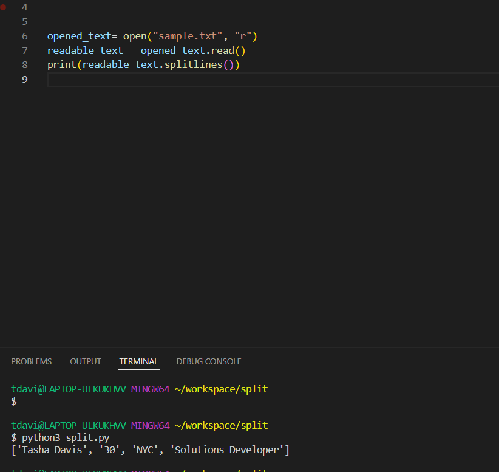

Tokenization is a really cool concept in Python that really used to confuse me when I was in my bootcamp, but recently connected very easily- so let’s talk about it.

What is tokenization? Tokenization basically means taking a entire unit and splitting it into smaller ones. There are a couple of ways to do this, but I want to focus on the split function. The split function does exactly what it sounds like, it splits the larger part into smaller ones. 
Let’s say you have a text that says “My name is Tasha”, by using tokenization, you can split this into a list composed of smaller pieces such as [“My”, “name”, “is”, “Tasha”].  You could also split it at every “a” to have a list that would look like [“My n”, “me is T”, “sh”, “ “]. You will notice here that the a’s go missing. That is because whenever the program runs into an “a”, it creates 2 sub strings, the first are the characters before the “a” the other are the characters after “a” until the program runs into another a. The final index is blank because there is nothing after the final “a” This happens in the first example too, the space is removed from that split! 
Let’s see what that would look like in code.

Take note that the I set the string to a variable and called the .split function. You can then insert whatever you want in the parathesis that you want to split the variable. Also note, it becomes a LIST. This means that you can store the newly tokenized list to a variable to use and access indices from. 

This can also be used to split a file into a list! For example, you can open a text and break it down line by line and put that into a list.
First you want to save your sample text- you do this by setting a variable, using open function, and use “r” or read mode. 
You then want to turn that saved open read file into a string by calling read function. 
You can then view this list of splitting line by line by calling splitlines function.

WOOF, that was a lot! Let’s take a look what this code looks like:

Just an FYI- the sample text and split code are in the same directory! 
This is useful for example, if you had a file with HR information, you could easily pull employee information from that list. Of course, that is a very basic example of what you can do with such a powerful tool. 

Now that wasn’t so bad, now was it? 

Learning how to manipulate data is an incredibly important skill to know in development- and tokenization is a great tool to do so. I encourage you to practice splitting and see just how many different things you can do! 

If you have any questions or just want to connect, feel free to reach out on LinkedIn or Github!

