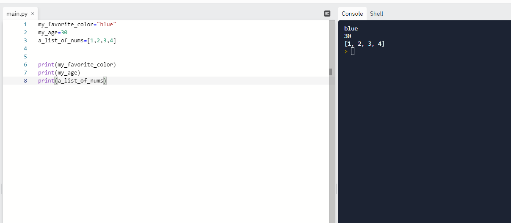
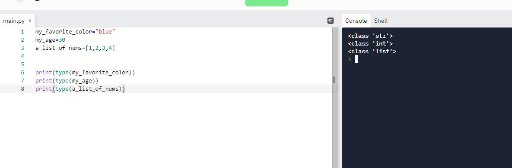
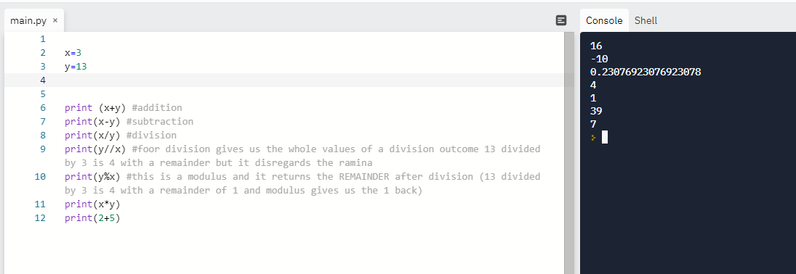
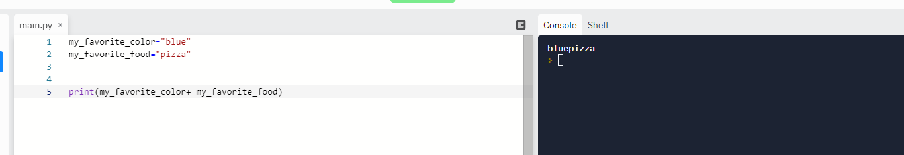
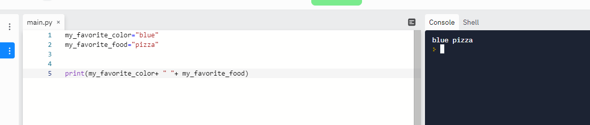

If you are taking the time out to read this blog, the title of this post may seem silly, but one day.. one day you will know....

Anyways, lets gets started. If you are doing this in order, last post we talked about why Python is, different data types, some syntax and the print function. Now, we are going to talk about variables. Oh, and before we get started, I’m TERRIBLE at math, so don’t let the word variable and some traumatic high school memory in math class deter you. 
So, where were we, right, what are variables? Variables are holders that store data. 

For example:

	x = 5   in this case, the variable, x, is storing the value 5

	x = ”cat” in this case, the variable, x, is storing the value cat

We can store values to variables in order to reuse them later- which seems very simple, but is incredibly important in Python. There are also some rules to, such as how to name a variable. In Python, the naming convention for variables is snake case- meaning that they should be lowercase, with words being separated with an underscore. There are also a list of words that cannot be used independently because they have meaning already in Python. A link of these words can be found here https://realpython.com/lessons/reserved-keywords/ or by typing “help(“keywords”)” in Python interpreter.
 
 For example:
	
	my_dog = “scout”
	
	my_favorite_tv_show = “Mr. Robot”
	
	dog_age=9
	
	my_list=[1,2,3,4,5]

When assigning variables, the values (information to the right of the equal sign) need to have quotation marks if it is a string! Numbers, lists, tuples and sets do not need to be place in quotes for assignment. 
Variables are also case sensitive. 

For example:
	
	My_dog=”scout”
	
	my_dog=”kevin”

These variables are 2 different variables due to the capitalized M in the first one. Python syntax is very important and is something that needs to be paid attention to when working with the language.  (And you may be thinking, hey, who is even making up all these rules? The answer is a bunch of really smart people who document these decisions in something know as PEP (Python Enhancement Proposals) and that is what programmers follow as convention. You can read more about it here:  https://www.python.org/dev/peps/pep-0008/)

So, we have gone over what a variable is and how to use it Let’s go into a https://replit.com/~ page or a new file in your editor of choice (I’m a VSCode girl myself) and try to assign some variables. You can check to see if assigning the variable works if you use the print function on the variable.  THAT WAS A LOT OF WORDS LETS BREAK DOWN WHAT THAT MEANS:

Pick a variable name and store the following information:

Your favorite color
Your age
A list with 3 numbers
Now print the variables! Feel free to take a look at my repl to see what my practice looks! 

You can see that all you need to do to print the variable is put it inside of the print function’s parenthesis. Once a value that is placed in parathesis is stored in a variable, you do not need parathesis to reference the value! 

Variables are very powerful and with a few more pieces of knowledge, you can do a lot with variables, so congratulations if you have assigned your first variable value- it’s a huge piece of information! 

The first thing that we can do is find out why data type of information is being stored to the variable. If you use the syntax
	print(type(your_variable))

Feel free to try this on the variables you created and as always, feel free to take a look at my example:

As you can see, the terminal shows us that the first variable is a string, the second is an integer and the third is a list. This will work for all data types, so feel free to create a dictionary, set or tuple, assign it to a variable and check it’s data type if you want to be sure! 

If we set a number to a variable, we can start to begin doing math, which is a huge leap from setting a variable. Python uses the following signs as arithemetic operators: “+” for addition, “-“ for subtraction, “*” for multiplication, “//” for floor division and “%” for modulus (I explain what floor and modulus mean below). 

Step 1- assign 2 variables, one x and one y with a number as a value

Step 2- print the following mathematical equations:
	
print (x+y) addition
print(x-y) subtraction
print(x/y) division
print(x*y) multiplication
print(y//x) floor division gives us the whole values of a division outcome 13 divided by 3 is 4 with a remainder but it disregards the remainder
print(y%x) this is a modulus and it returns the REMAINDER after division (13 divided by 3 is 4 with a remainder of 1 and modulus gives us the 1 back)

Once you do that, compare your answers to my own (the math will be different if you didn’t pick the same numbers, just keep that in mind). Also, please note you don’t need to use variables to use these operators if you take a look at my last example! 

We can also do this to variables that have strings assigned as their values. Assign 2 variables, one as your favorite food and one as your favorite color and try to use the addition symbol like we did in the math example and what happens?

The words join! This is called string concatenation- adding strings together. You can do this with as many variables as you want and this is very helpful for the future. You may notice that there is no space between the 2 strings and that is because computers will not do anything unless we tell them to! If you want to add a space, simply add “ ” between your words with a plus sing between:

For example:
	
	var_1 =”hello”
	var_2=”world”
	print(var_1 + “ “ + var_2)

And here is what my terminal looks like!

Take a breath because that was a lot! In fact, that’s all we are going to cover today! 

So let’s take a second to recap what you learned:

-what a variable is

-how to declare a variable

-variable naming conventions

-what arithmetic operators python utilizes

-how to use operators 

-what string concatenation is and how to add spaces between variables

Oh and flash cards of course https://quizlet.com/_ap1m5k?x=1qqt&i=2ifdye

And as always if you have any questions, comments, or inquiries, feel free to reach out to me! 